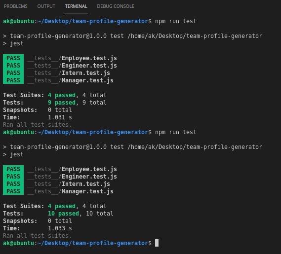

# team-profile-generator

## Description
 Node.js command-line application that takes in information about employees on a software engineering team and generates an HTML webpage that displays summaries for each person.

## User Story
* I WANT to generate a webpage that displays my team's basic info
* SO THAT I have quick access to their emails and GitHub profiles

## Acceptance Criteria
GIVEN a command-line application that accepts user input<br />
WHEN I am prompted for my team members and their information<br />
THEN an HTML file is generated that displays a nicely formatted team roster based on user input<br />
WHEN I click on an email address in the HTML<br />
THEN my default email program opens and populates the TO field of the email with the address<br />
WHEN I click on the GitHub username<br />
THEN that GitHub profile opens in a new tab<br />
WHEN I start the application<br />
THEN I am prompted to enter the team manager’s name, employee ID, email address, and office number<br />
WHEN I enter the team manager’s name, employee ID, email address, and office number<br />
THEN I am presented with a menu with the option to add an engineer or an intern or to finish building my team<br />
WHEN I select the engineer option<br />
THEN I am prompted to enter the engineer’s name, ID, email, and GitHub username, and I am taken back to the menu<br />
WHEN I select the intern option<br />
THEN I am prompted to enter the intern’s name, ID, email, and school, and I am taken back to the menu<br />
WHEN I decide to finish building my team<br />
THEN I exit the application, and the HTML is generated<br />

## Languages
HTML, CSS, Bootstrap, Google Fonts, JavaScript, Node, Inquirer, Jest

## Installation
The application require the use of Jest for running the unit tests and Inquirer for collecting input from the user. 

## Usage
As a manager of a team, you would enjoy using this application to generate a webpage that displays your team's basic information so that you can quickly access their emails and GitHub profiles

To use this application, clone the repository to your local machine: 
```
git clone git@github.com:amykep/team-profile-generator.git
``` 

Then, ensure you install the dependencies with command: 

```
npm install
```
When you're ready to run the application, from the root folder, type the below into your command line: 

```
node index
```
Once the application runs, it will generate an index.html file in the "dist" folder. If you already have an index.html file in that folder, it will first prompt you to overwrite it or not.

## Tests
to run the tests for this application, enter "npm run test" in the command line


## Deployed application link
https://github.com/amykep/team-profile-generator

## Video to domenstrate the application
